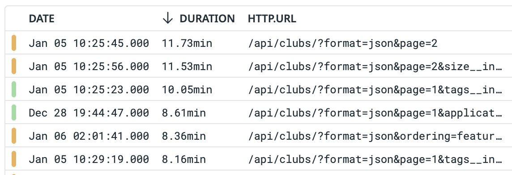
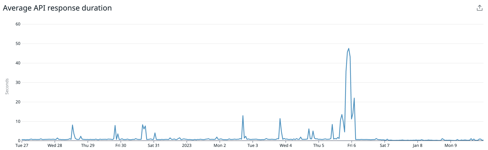

The 19th of September, 2022 might have been an innocuous Monday for most, but
over at Penn Clubs -- things were getting rocky. The last day of the
[Wharton Council Centralised Application](https://pennclubs.com/apply), Penn Clubs went down
for around 10 minutes in the afternoon. We quickly pinpointed database
throttling as the cause, bumped up our instance class and things were golden
again -- no other telltale issues.

Fairly normal, we thought. It's the last day of applications. Of course everyone was
getting their submissions in last minute. With fairly substantial historical load (~1500
unique applicants, ~5000 applications), we brushed it off as a "random" failure
of the database. Everything else was green too; the usual pod, CPU, memory, node
metrics looked _great_ so I was confident that nothing worse could happen.


<p class = image-caption>
My affirmation to the Wharton Council representative.
</p>

Famous last words.

I was sipping on some [whisky](https://house.suntory.com/toki-whisky) and watching TV with some friends at
around 9pm when I
received the unfortunate news that Penn Clubs was down, again. Looked like the
Targaryen family feuds had to wait! [Uptime](https://xkcd.com/705/) was
more pressing.

# Problem

After about 30 minutes of staring at metrics dashboards, the platform team, outgoing co-director Campbell, and I eventually pinpointed that it was the database (and _only_ the database) again. Somehow we were at 99.9% CPU utilization, which effectively throttled read/write performance severely. We figured there was an excess of queries running which not only slowed query speeds to a crawl but also, strangely, left behind some long-running "suspended" queries that were busy-waiting on the database CPU.

Busy-waiting is a computer science concept which involves a stalling process being scheduled by a system (OS, database, etc) -- resulting in using 100% of available CPU. The simplest example of a busy wait is as follows:

```C
int main(void) {
	printf("Loop forever\n");
	while (1) {
	}
}
```

In this case, the long running queries were frozen but the database didn't know
any better to terminate them, so they hogged the majority of the CPU. Our
immediate hotfix, kudos to Campbell, was to write a script that periodically killed all long-running queries (>30s runtime).

However, perhaps more importantly, it didn't quite make sense to us why we had
so many queries hitting the database, and even less so why some were magically
frozen. Our database instance class was not small and our load _should have_
been ~O(1000) qps, perfectly reasonable given our infrastructure setup. And so we jumped
down the investigative rabbithole!

# Profiling Penn Clubs

Penn Clubs is probably one of our more involved products in terms of database
design. We employ a variety of models to capture the nuances of user, clubs, fairs,
applications and their relations. Crucially, as we scale, this introduces a lot
of scope for complex queries, elaborate Python logic, and Django ORM inefficiencies
-- all of which could trickle down to various database problems.

## Queries, Queries, and more Queries

To dig at the root of this problem, we started with looking at which
API endpoints took the longest to respond (thanks to Peyton). To do this, we used a piece of
software called [Datadog](https://www.datadoghq.com/), which hooks
into all our products and collects important monitoring data.



Wow! Looks like <code>/api/clubs</code> (the homepage) could be _really slow_. This makes
sense, since the list of clubs we load on the homepage involved a lot of SQL joins, ordering,
and computing aggregations. Importantly, for someone to get to the application
page, they were likely visiting the homepage first, then going to individual
clubs' homepages, and finally clicking the Apply button. In the process, we ran
this expensive and ugly query for <code> /api/clubs </code>, as well as one for
<code> /api/clubs/<club_code> </code>.

This clearly created a lot of redundancy: each user that wanted to apply to a club would
inadvertently trigger a set of expensive database operations that were
unnecessary - the list of clubs and their related fields are mostly static.
Queries to these pages, while optimised, were still large and operated on about ~100k DB objects across tables.

To solve this, we introduced a cache layer to our core backend services. This
cached the database-computed queryset with a TTL of 1 hour. We invalidated
this cache on object creation or updates (as well as updates to important
related fields). During peak traffic, this was sure to minimize load on the database and maintain
the performance of our website. Reads from Redis are very fast (we averaged 4.2ms using the
Django cache client), so we expected our API to get faster too.

## Optimisation, ft. the N+1 problem

Another pain point in our code was that we had some of our more complex query logic
written in Python (using for loops and Python objects). Python is
notoriously slow at CPU intensive tasks, but at the same time the query was not
expressable using the usual set of Django ORM functions. We had to insert some [Raw SQL](https://github.com/pennlabs/penn-clubs/pull/482)
to transfer the heavy lifting over to the database. While this is generally
frowned upon, it is useful in cases where the ORM fails to model the desired
query exactly. This improved query performance for the same set of objects by
around ~10x.

We were also a victim of the infamous [N+1
problem](https://stackoverflow.com/questions/97197/what-is-the-n1-selects-problem-in-orm-object-relational-mapping).
Many of our serializer calls also invoked related fields' serializers which
slipped through our notice but added on extra queries. The presence of multiple
many-to-many relationships meant that fixing these queries (using Django's
<code> Prefetch and select_related </code> led to a reduction in the number of
queries hitting the database (per lookup of affected objects) by a factor of ~100!

A common theme with these two problems is that they are both rooted in the
pitfalls of the Django ORM. While the ORM is certainly convenient, readable, and
intuitive to use, it requires some degree of expertise to write performant
code with. It's certainly better than writing only SQL though. We're not a
data science club.

## Caching redux

At this point, we've implemented a fairly robust cache layer and also optimised
our database logic so our endpoints do at most 5-6 queries on the DB. However,
performance wasn't quite where we wanted it to be. For some reason, some of the
heavier endpoints still took >3 seconds. Our database isn't that large, so this
was puzzling. Additionally, our stack (React + Django) was not chosen for [blazingly
fast](https://www.reddit.com/r/rustjerk/comments/sqy221/anything_built_in_rust_is_blazingly_fast_by/)
performance, but we were still slower than expected.

Digging even further, the problem seemed to lie in the serializer. For
the application submission route (optimised earlier using raw SQL), the query by itself took
less than a second, but serializing took around ~7s. It is apparently well known
that model serializers are
[extremely](https://hakibenita.com/django-rest-framework-slow)
[slow](https://stackoverflow.com/questions/29016879/modelserializer-is-extremely-slow-in-django-rest-framework).
Caching database results was certainly useful to reduce load on the database,
but did little to improve the actual performance of the site.

To combat this, we adopted a different caching strategy. Instead of just caching
database results, we cached entire JSON responses, keyed on URL. Django's handy decorator
for this (<code> cache_page() </code>) was limited to TTL-based
invalidation, so we wrote custom caching and invalidation logic by
overriding methods on our routes. At this point, almost all our heavy-hitting
read views were served through the cache, freeing the database for writes. And all of this only took up about ~20MB in
Redis!

## Results

Penn Clubs had seen complaints in the past about slow performance, especially
during peak load - it's always been on our backlog to look at our code more
closely. With average homepage load times of about 4-5 seconds, our baseline was
undeniably poor.

All of our work led to big boosts in performance numbers. Across the entire Penn
Clubs API, we saw a reduction in mean response time from 700ms to 200ms. On heavy
endpoints, we saw reductions by a factor of 10. We also saw fewer spikes in the
query times, reflecting a lack of throttling despite increased traffic.



<p class = image-caption>
Average API response times. Changes implemented on ~Jan 6.
</p>

In addition to these metrics, we saw significantly reduced load on our database, with read and
write latency improving both about 2x on average alongside reduced variance. Our
projected Redis memory usage is also around 500 MB at peak, with an average of
20MB: basically nothing! Given that our average Redis memory usage prior to this was about 1 MB, it
is safe to say we were underutilising a hidden gem in our setup.

## Conclusion

Perhaps the key takeaway from this blog post is not to (falsely) promise 100%
availability. If even AWS can only do 99.99%
at best, we shouldn't get ahead of ourselves. This is all to say that Penn Clubs
may very well go down again during application season. In that case, you will
either find me resigning or jumping down yet another rabbit-hole - I'd rather not
find out which.

On a more serious note, Penn Clubs has seen a lot of important design changes and
realizations, the primary of which is due to the fact that most of the content we serve is
static. The list of clubs, applications, and application submissions (after deadline) all change
very infrequently. Given that all our products use a shared database instance,
and our applications interact with the database a lot, capitalising on this fact
seems to have had the largest positive effect on our performance.
