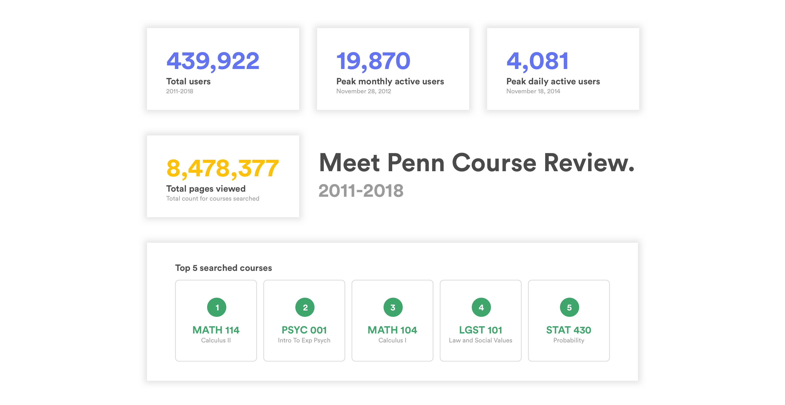

*This article was written by [Tiffany Chang](http://tifchang.com).*

Meet the new Penn Course Review.

### 🚶‍Down memory lane

The student-run [Penn Course Review](http://penncoursereview.com) has served as a valuable guide for course selection since the 1960s. From paper book to web app, it continues to provide course statistics to better inform students during course selection. Penn Course Review was a student club motivating insight-driven course selection. With even more energy, Penn Course Review is now developed and managed by us, [Penn Labs](http://pennlabs.org), a group of students passionate about solving problems at Penn through technology.

In 2010, Penn Course Review was launched with a sleek, simple, and sexy design. How sexy was it? Let’s take a look at how we’ve been using it.

### 📊 Quick stats

### 🤷‍ But it’s not perfect

As time passed, we received comments, critiques, and complaints. No worries, we heard you, and we’re so glad you took the time to tell us what you wanted. After reviewing years of feedback, hearing your complaints in Van Pelt, and watching friends struggle with clunky excel sheets to optimize course load, we realized there was a lot of work to do. We decided to focus 2017 on building a better experience around you.

### 👋 Meet the new Penn Course Review

We’re so excited to finally announce the new Penn Course Review, a new experience with the same promise. With added features, simplified views, and (for our technically savvy folks) a new stack for performance and efficiency optimization, we hope you enjoy it as much as we enjoyed building it for you.

**✨ New UI:** We’ve recently updated our design guide and have begun syncing our product designs across the board while maintaining key Penn Course Review interactions. We hope you enjoy the simple, sweet, and complete interface.

**🛒 Course cart:** Add courses to your cart, compare, contrast, and get insights on your entire semester’s course load. Include and exclude classes to see how your ratings change with and without a course.

**🔍 Search within course or professor:** We’ve added a search bar within the course table to help you find the specific course/professor/anything you’re looking for.

**👩‍🏫 Department view:** Trying to decide which FNAR course to take? Take a look at the department view and get a cross-section of all FNAR courses. Use our handy quick course comparer to see your options side-by-side.

**🚨 Get alerts:** It’s easier than ever to stay updated on a course’s status. Penn Course Alert is now connected with Penn Course Review in just one click. Check if a course is open, and if not, be the first to know when it opens.

**🎨 Color calibration:** Ratings are color coded.

* 💛: < 2

* 💜: < 3

* 💚: ≥ 3

**☁️ Cloud:** We’ve migrated Penn Course Review from a physical server to the cloud to optimize speed and performance.

*For a technical deep-dive on the update, see this [article](/blog/pcr-tech-18).*

### 🙏 Special thanks to the team

* **V.2018**: [Brandon Lin](https://github.com/esqu1) (PM/Backend Developer), [Cassandra Li](https://github.com/orgs/pennlabs/people/cassandrali) (Frontend Developer), [Eric Wang](https://github.com/ezwang) (Fullstack Developer),[Josh Doman](https://github.com/joshdoman) (Director), [Suzanne Knop](https://github.com/sknop8) (Frontend Developer), [Tiffany Chang](http://tifchang.com) (Director/Designer), [Vinai Rachakonda](https://github.com/VinaiRachakonda) (Backend Developer), [Yonah Mann](https://github.com/ymann) (Backend Developer).

* **Our legacy**: [Adel Qalieh](https://github.com/adelq), [Adam Domingoes](https://github.com/adamdom), [Alexey Komissarouk](https://github.com/AlexeyMK), [Ceasar Bautista](https://github.com/Ceasar), [David Lakata](https://github.com/dlakata), [Derek Jobst](https://github.com/derekjobst), [Greg Terrono](http://Greg Terrono), [Kyle Hardgrave](https://github.com/kylehg), [Matt Parmett](https://github.com/mattparmett), [Nop Jiarathanakul](https://github.com/nopjia), [Prakhar Bhandari](https://github.com/pbjr23), [Reika Yoshino](http://www.reikayoshino.com/), [Sumit Shyamsukha](https://github.com/sumitshyamsukha), [Vivek Panyam](https://github.com/VivekPanyam), [Yefim Vedernikoff](https://github.com/yefim).

