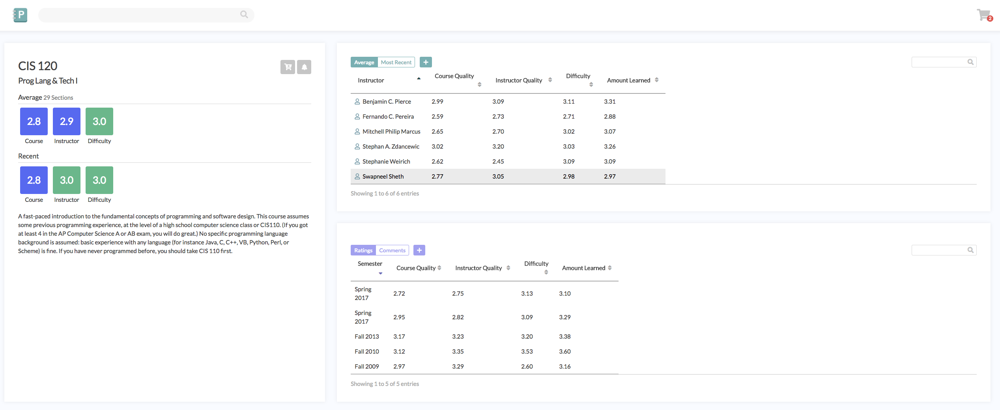

*This article was written by [Brandon Lin](https://github.com/esqu1).*

This article is a continuation of a previous article about Penn Course Review’s new redesign. See [here](/blog/pcr-makeover-18) for that article.

## **A monolithic project**

Maintaining Penn Course Review was never an easy task. Being one of Penn Labs’ most well-known products and having one of our largest codebases, working on the project was a massive undertaking. Nevertheless, the fantastic developers at Penn Labs helped make the new makeover possible.

This article serves to highlight some of the technicalities of the new makeover.

## About Penn Course Review

Penn Course Review is primarily written in Python, using the Django framework. Both the front end and the back end rely on this framework, while all of the data is stored in a MySQL database.

We’ll go over the front end and the back end components separately here.

## Front End

We’re redesigning the Penn Course Review experience to make it easier and faster for you to find the courses you need.

### Page Size

We thought about how inconvenient it was to scroll through a really long page to find a professor. With jQuery DataTables, we were able to condense most of the information down into a simple, intuitive format that lets you scroll through professors with ease.

This also led us to put the individual ratings and comments in a separate card, so that you don’t have to constantly scroll in order to view different ratings between professors and courses.

## Back End

Regarding the back end side, most of our work involved cleaning up legacy code that ran on an old version of Django and providing more documentation to the existing API endpoints. We also introduced Sentry error logging to make it easier for future developers of the project to work on it more easily.

### API Refactor

We refactored the majority of the API to conform to Django standards and make the API more RESTful. With the new Django update, we had to conform to these new standards with new endpoints and better code style. Previously, many endpoints were nonintuitive and didn’t follow these standards. We added several endpoints that, for example, allow you to fetch all history about a course.

### DigitalOcean Migration

We moved all of our production code to DigitalOcean from an old server that sat in the STWing area in King’s Court. We wanted to make our service more reliable and migrating everything to DigitalOcean gave us the scalability and control that we needed. The old server suffered from a majority of outages and disk breakages that would render the server inaccessible, and we decided that moving to DigitalOcean would be the best bet.

### Massive Data

The big challenge that Penn Course Review has faced over the years is how to deal with the massive dataset containing course and professor ratings/comments. With a ton of ratings, loading a single webpage and compiling all results from the database for that webpage would take quite some time.

Traditionally, the solution has been to generate static webpages for each course and professor separately (in a process that takes about 9 hours), so when users fetch a webpage, it’s as simple as getting a pre-generated HTML file.

Obviously this wasn’t very storage friendly and severely non-scalable if we ever want to make any quick changes/bug changes to the website. We were looking for a way to allow for easy website changes while keeping the user experience as fast as it was previously.

The best way to mitigate between these to was to configure our server to cache the page generation whenever a new page request comes in; this way, we don’t hog server space and we can still deliver pages quickly for very popular courses (such as MATH 114). The cache is set to reset every day. This way, we can seamlessly make changes to the site while being able to give the same user experience.

### Shibboleth

We also transitioned over from Penn’s old authentication system, Cosign, to their new system, Shibboleth.

## Conclusion

Thanks so much to the Penn Course Review team and all of the developers and PM’s at Labs for making this revamp possible; special shoutout to Tiffany Chang and Josh Doman for being fantastic directors and mentors for this project.
